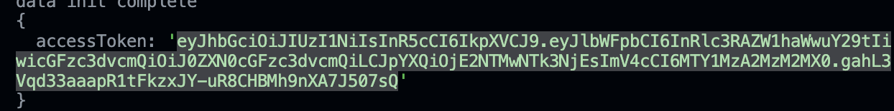

### 사용 기술
- Node.js, Express, Typescript
- MySQL
- Jest, Supertest

### 실행 방법
1. DB 생성
2. /secret.env 파일의 DB 접속 정보를 본인의 환경에 맞게 변경
3. 터미널에 npm install 입력
4. 터미널에 npm run build 입력
5. 터미널에 npm start 입력
6. 아래의 API End point에 요청
    - 포인트 적립
        - POST /events
        - Request body의 action 값(ADD, MOD, DELETE)에 따라 포인트 생성, 수정, 취소 처리됨
    - 포인트 목록 조회
        - GET /point/list/:userId
    - 보유 포인트 합계 조회
        - GET /point/total/:userId
        
### 테스트 코드 실행 방법
1. TEST DB 생성
2. /secret.env 파일의 TEST_DB 정보를 본인의 환경에 맞게 변경
3. 터미널에 npm test 입력

### 테이블, 인덱스 DDL 파일 위치
- /ddl.sql

### 기타
1. 1-2-3-4-5 형태의 UUID를 32145  형태로 변경한 이유
    - UUID를 생성한 그대로 사용하면 인덱스 성능이 낮다고 함
    - 위 처럼 32145 형태로 변경하면 auto_increment 값을 PK로 사용하는 것과 비슷한 성능을 낼 수 있다고 하여 변경함
    
2. 간단한 인증 프로세스 구현  
    - 개발 중에 인증된 클라이언트만 API를 요청할 수 있어야 한다는 생각이 들어서 간단한 인증 토큰 생성 / 인증을 구현하였습니다.  
    - 만약 적용하고 테스트하려면 src/app.ts 파일의 주석을 참고하여 실행할 미들웨어 코드를 교체하고,  
    아래의 이미지와 같이 서버 시작 시 터미널에 찍히는 accessToken을 authorization 헤더에 추가하여 API를 요청하면 됩니다.
    
    
3. 포인트 내역 테이블 설계에 대한 고민
    - 처음에는 point 테이블에 review_type, review_id 컬럼을 만들고 리뷰에 대한 포인트만 저장하게 설계하였다. 하지만 나중에 "리뷰 외에 다른 경우에도 포인트를 적립하게 된다면?" 이라는 생각이 들었고 기존의 review_type, review_id 컬럼을 source_type, source_id, memo 컬럼으로 변경하여 혹시 모를 다른 경우에도 포인트를 적립할 수 있는 구조로 변경하였다.
    
